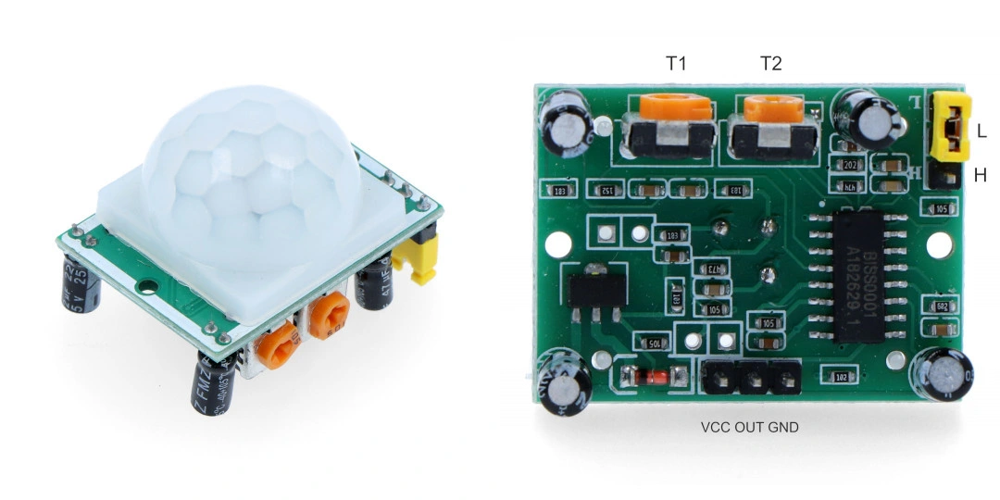

# Physical Computing

Zajęcia poświęcone są osadzeniu kodu w kontekście fizycznym. Połączenie „bitów i atomów", dzięki tworzeniu układów elektronicznych. Duży nacisk położymy na nadawanie interakcji formy namacalnej/fizycznej, czyli „ucieleśnianie" informacji albo „ożywianie" przedmiotów, reagowanie na widza i zmianę kontekstu, czy konstruowanie wyrafinowanych form interakcji i zachowań.
Ponadto opanujemy podstawy programowania cyfrowych układów elektronicznych. Nauczymy się tworzyć obwody elektroniczne reagujące na bodźce z otaczającego środowiska i wpływające na te środowisko poprzez dźwięk, światło i oddziaływania mechaniczne.
Opanujemy popularną platformę Arduino służącą do tworzenia szybkich prototypów, a skonstruowaną z myślą o artystkach i projektantach. Nauczymy się używać podstawowego zestawu sensorów i aktuatorów.

Do tego otrzymaliście od nas zestawy z odjazdowym malezyjskim `Maker Nano` i zestawem komponentów, seniorów i aktuatorów. Niektóre gotowe do użycia, inne wymagające dolutowania gold pinów. Jednym słowem wszystko co niezbędne, żeby nauczyć się podstaw konstruowania obwodów elektorniczny do tworzenia instalacji.
   
## Zestawy rozdane

## Skład zestawu 
Poniże szczegółowy opis elementów w zestawie, wraz z odesłaniami do bibliotek tam gdzie są one wymagane.
 
# 
#### Maker Nano - malezyjskie Arduino, świetne!

Twórczo przetworzona oryginalna koncepcja Arduino, z przydatnymi  podczas nauki modyfikacjam. Dodatkowe 12 Led przy każdym pinie cyfrowym, dodatkowy przycisk na pinie 2, oraz głośniczek na pinie 8.

- [Detale techniczne i drivery](https://www.cytron.io/p-maker-nano-simplifying-arduino-for-projects) 

# 
# 
#### Czujnik ultradźwiękowy - HC-SR04  

Ultradźwiękowy pomiar odległości 2 cm - 200 cm. 
##### Zastosowanie 
Omijanie przeszkód przez robota, wykrywanie obecności człowieka w konkretnym miejscu przed obiektem itp.
##### Biblioteka
- [Ping](https://playground.arduino.cc/Code/Ping/)
- [New Ping](https://bitbucket.org/teckel12/arduino-new-ping/wiki/Home)
# 
# 
#### Sterownik ULN2003 i silnik krokowy 28BYJ-48

Steruje silnikiem krokowym za pomocą 4 pinów cyfrowych.
Najłatwiej używać z biblioteką, ale dla zaawansowanych można też bez.
##### Biblioteka
- [podstawowa Stepper](https://www.arduino.cc/en/reference/stepper)
- [polecana AccelStepper](http://www.airspayce.com/mikem/arduino/AccelStepper/index.html)
# 
#### Silnik krokowy 28BYJ-48
Pozawala na bardzo precyzyjne i płynne poruszanie. Świetne nadaje się do płynnego poruszania szczególnie z małą prędkością.
#####  Parametry
- Napięcie: 5V
- 64 kroki na pełen obrót
- 4-fazowy
- Przekładnia 1:64
- Wymaga sterownika np. ULN2003
- Wymiary poniżej:

# 
# 
#### Serwo 

Serwomechanizm ustawia się pod zadanym w kodzie kontem. Jest szybki. Potrzebuje niewiele czasu by przesunąć owczych do zadanego konta. Jest lekki ale silny 1,8 kg/cm :)
##### Parametry
- Moment: 1,8 kg/cm
- Waga: 9g
- Prędkość: 0,12 s/60st
- Napięcie pracy: 4,5V - 6V
- Materiał trybów: tworzywo
- Złącze: servo JR
- Sterowanie i zasilanie: 
* brązowy - GND, 
* pomarańczowy - 5V, 
* żółty - pin cyfrowy 
##### Biblioteka 
- [Servo](https://www.arduino.cc/en/reference/servo)
# 
# 
#### Czujnik dźwięku 

Detektor hałasu. Układ posiada wyjście cyfrowe Out, które w momencie wykrycie dźwięku przyjmuje stan niski, wbudowany potencjometr służy do ustawienia progu zadziałania, przełączania. ##### Parametry
- **Bez biblioteki**
- Podłącza się pod pin cyfrowy `OUT`
# 
# 
#### Neopixele, czyli diody LED RGB (full color) ze sterownikami 

WoW! Jest kolorowo! Siedem diod RGB, a każda 16 mln kolorów i wszystko sterowane za pomocą jednego pinu, bo każda dioda ma indywiduany sterownik WS2812. 
[Więcej na stronie sklepu Botland :: NeoPixel Jewel - pierścień LED RGB 7xWS2812 5050 - Adafruit 2226](https://botland.com.pl/lancuchy-i-matryce-led/2945-neopixel-jewel-pierscien-led-rgb-7xws2812-5050-adafruit-2226.html)

##### Parametry
- Sterownik **WS2812**
- Układ kolorów **GRB**
- Model całego układu **NeoPixel Jewel - - Adafruit 2226**
- Model diody 5050
##### Biblioteki
- [FastLED Animation Library](http://fastled.io)
- [Neopixel](https://learn.adafruit.com/adafruit-neopixel-uberguide)
# 
# 
#### Czujnik odbiciowy

Wykrywa za pomocą światła podczerwonego przeszkody w niewielkich odległościach. Działa **bez biblioteki**
##### Parametry
- Zakres odległości: 0,2 cm - 10 cm
- Podłącza się po pinu analogowego wyjście A0 lub cyfrowego wyjście D0
- Moduł czujnika TCRT5000 
# 
# 
#### Czujnik ruchu PIR HC-SR501 - zielony

Czujnik typu PIR pozwala na wykrywanie ruchu, np. wykorzystywany do wykrywania obecności człowieka. Działa **bez biblioteki**
[więcej na stronie Botland](https://botland.com.pl/czujniki-ruchu/1655-czujnik-ruchu-pir-hc-sr501-zielony-5903351241359.html)
##### Parametry
- Napięcie zasilania VCC: od 4,5 V do 20 V
- Zakres pomiarowy: maks. 7 m
- Kąt widzenia: do 100°
- Wyjście cyfrowe `OUT`: Stan wysoki - obiekt wykryty, Stan niski - brak obiektu

# 
# 
#### MPU-6050 3-osiowy akcelerometr i żyroskop I2C 

Czujnik do pomiaru przyspieszeń oraz prędkości kątowej w trzech osiach. Jest połączeniem 3-osiowego akcelerometru i żyroskopu. Komunikuje się poprzez magistralę I2C.
##### Parametry
- Napięcie zasilania: od 3,0 V do 5,0 V
- Napięcie pracy wyprowadzeń: od 3,0 V do 5,0 V
- Trzy osie: X, Y, Z
- Interfejs komunikacyjny: I2C (TWI) - 400 kHz
- Rozdzielczość: 16-bitów dla każdej osi
- Zakresy pomiarowe (konfigurowalne): Akcelerometr: ±2 g, ±4 g, ±8 g, ±16 g; Żyroskop: ±250 °/s, ±500 °/s, ±1000 °/s, ±2000 °/s
##### Biblioteka 
- [MPU6050](https://www.arduino.cc/reference/en/libraries/mpu6050/)

# 
# 
#### Fotorezystor 

Nasz ulubiony czujnik. Wykrywa natężenie światła. Proste działanie, a można uzyskać ciekawą dynamikę np. sprzęgając sygnał z fotorezystora z reakcją serwomechanizmu.
##### Parametry
- Średnica 5 mm.
- Opór przy typowym oświetleniu 10k-20k.
- Opór zmienia się w zależności od natężenia padającego światłą.
- Podłącza się do pinu analogowego.
- Sprytnie bez rezystora z `INPUT_PULLUP`.
# 
# 
#### Przycisk chwilowy (3 szt. Czerwony, zielony, niebieski)

Przycisk chwilowy którego wciśniecie zwiera piny bliższe siebie (tak samo po dwóch stronach). Wystarczyłby 2 piny, ale są 4 żeby lepiej trzymało się płytki :)
##### Parametry
- wymiary 6x6x5mm.  
- 4 pin. 
# 
# 
#### OLED 0.91" 128x32px I2C

Wyświetlacz OLED o przekątnej 0.91" i rozdzielczości 128 x 32 px. kolor wyświetlanych znaków - biały. Ekran oparty na sterowniku SSD1306 pracuje z napięciami 3,3 V oraz 5 V, komunikuje się poprzez interfejs I2C.
##### Parametry
- Sterownik **SSD1306**
- rozdzielczości `128 x 32 px`
- Połączeni z Arduino przez `I2C` (SDA, SCL)
- napięcie 5V lub 3.3V
##### Biblioteki
- [Adafruit SSD1306](https://github.com/adafruit/Adafruit_SSD1306)
- [U8g2: Library for monochrome displays](https://github.com/olikraus/u8g2)
# 
# 
####  Diody LED 5 mm (4 szt.) - czerwona, zielona, niebieska i żółta

Półprzewodnik. Świecie tylko jak krótsza noga do GND, a dłuższa do pinu. Nie podłączać bezpośrednio do GND i 5V bo się spali :)

##### Parametry 

###### dioda żółta:
- Obudowa: DIP 5 mm
- Długość emitowanej fali: 589 nm
- Jasność: 40 mcd
- Kąt świecenia: 60 °
- Temp. pracy: od -40 °C do +80 °C
- Prąd If: 25 mA
- Napięcie Vf: 2,0 V

###### dioda zielona:
- Obudowa: DIP 5 mm
- Długość emitowanej fali: 571 nm
- Jasność: 100 - 150 mcd
- Kąt świecenia: 50°
- Temp. pracy: od-40 °C do +80 °C
- Prąd If: 20 mA
- Napięcie Vf: 2,3 - 2,5 V

###### dioda czerwona:
- Obudowa: DIP 5 mm
- Długość emitowanej fali: 625-645 nm
- Jasność: 450 - 800 mcd
- Kąt świecenia : 70 °
- Temp. pracy: od -40 °C do +80 °C
- Prąd If: 20mA
- Napięcie Vf: 2,0 - 2,3 V

###### dioda niebieska:
- Obudowa: DIP 5 mm
- Długość emitowanej fali: 470 nm
- Jasność: 400-600 mcd
- Kąt świecenia : 30° °
- Temp. pracy: od -40 °C do +80 °C
- Prąd If: 20mA
- Napięcie Vf: 3,3 V
# 
# 
#### Płytka stykowa zwana też [breadboard](https://en.wikipedia.org/wiki/Breadboard)
 

Schemat połączeń 

Posłuży do tworzenia obwodów bez lutowania. Otowry wewnętrznier połączone, w każdej kolumnie `1,2,3,4,…,30` po pięć dziurek `a,b,c,d,e` oraz `f,g,h,i,j` jak zaznaczone na zdjęciu powyżej. Linie zasilania `+/-` połączone w poziomie. 
##### Parametry
- 400 otworów w zewnętrznymi stykami
# 
# 
#### Potencjometr obrotowy 10kΩ

Proste pokrętło podłączone do wyprowadzeń analogowych pozwala płynnie regulować coś (prędkość, położenie serwa itp.). Kąt obrotu pokrętła odczytujemy jako wartość na wejściu analogowym `OUT`. 

# 
# 
#### Kabel Micro USB -> USB A (różowy!) 

Do komunikacji między komputerem a `Maker Nano`. Pozwala załadować kod do mikrokontrolera, ale też odczytywać dane wysyłane przez mikrokontroler. Dostarcza też zasilanie 5V. Po wgraniu programu możemy podłączyć do ładowarki USB i nadal działa, bo do działania nie potrzebuje komputera, a wyłącznie zasilania :)

# 
# 
#### Przewody 

Jakoś to wszytko trzeba połączyć. Przewody ze złączami. Możliwość szybkiego łączenia bez lutowania, bezpośrednio Arduino z czujnikami lub za pomocą płytki stykowej.
##### Rodzaj przewodów w zestawie
- 10cm - męsko-żeńskie w taśmie - 20 szt.
- 10cm - żeńsko-żeńskie w taśmie - 10 szt.
- 20cm - męsko-męskie w taśmie - 10 szt.
# 
