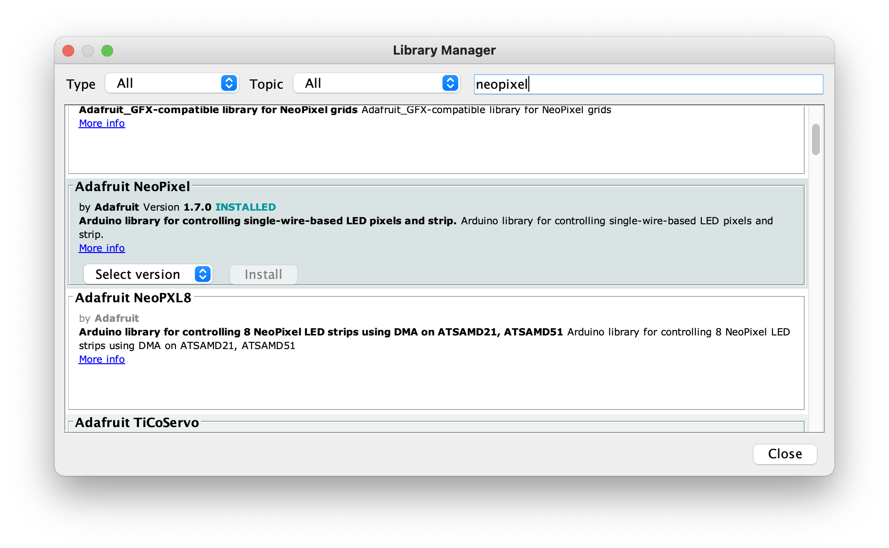
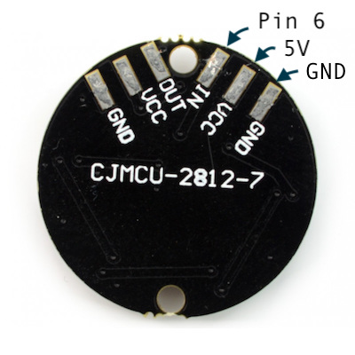
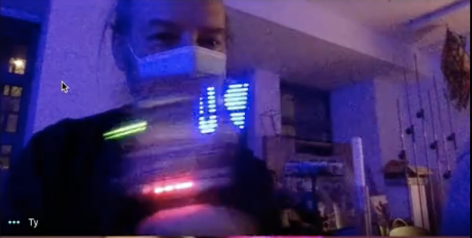

# Sezon 01 - lutowanie i miganie

Pierwsze zajęcia offlinie. Zaczęliśmy of rozdania prezentów :)

## Prezent

## Poruszone zagadnienia

### Lutowanie
- Jak poprawnie wykonywać luty.
- Trening lutowania na module pierściania LED. Dolutowanie goldpin (nie wszysko złoto co … ;)).

- [Soldering (cool!) video)](https://youtu.be/QKbJxytERvg)
- [Przewodnik lutowania z Adafruit](https://learn.adafruit.com/adafruit-guide-excellent-soldering)

### Maker UNO - malezyjskie Arduino, świetne!

Twórczo przetworzona oryginalna koncepcja Arduino, z przydatnymi  podczas nauki modyfikacjam. Dodatkowe 12 Led przy każdym pinie cyfrowym, dodatkowy przycisk na pinie 2, oraz głośniczek na pinie 8.

- [Detale techniczne i drivery](https://www.cytron.io/c-arduino/c-arduino-main-board/p-maker-uno-simplifying-arduino-for-education) 
- [Maker UNO: Simplifying Arduino for {Education}](https://makeruno.com.my)

- Wgrywanie kodu na Arduino, wygór kłytki, portu.
- Miganie diodami wlutowanymi w Maker Uno, instrukcje `pinMode();` `digitalWrite(7, HIGH);` `delay(400);`
- Beep! Beep! instrukcja `tone(8, 440);`
- Pierścień `LED RGB 7 x WS2812 5050`

- `Adafruit NeoPixel` Library, do obsługi `LED WS2812` zwanych też `NeoPixel`
- Jak instalować biblioteki: Arduino IDE, wybrać w menu `Sketch > Include Library > Manage Libraries`, a następnie wyszukać bibliotekę wpisując np. neopixel

- Podłączenie Neopixel do Arduino

- Przykładowy kod `strandtest`. Wymaga zainstalowania biblioteki `Adafruit NeoPixel`

- Na koniec zajęć przykład z POV (Persistence of Vision) `MakerUno_POV`

