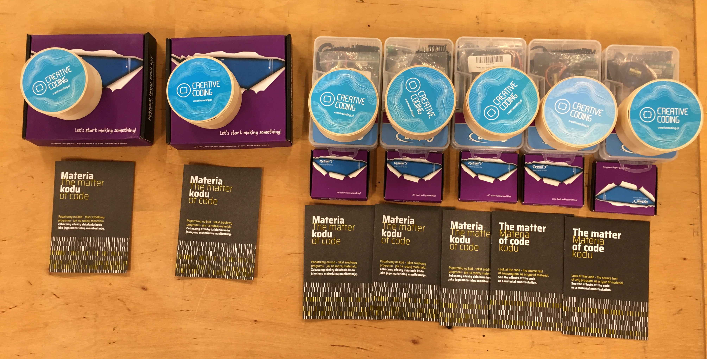

# Sezon 01 - lutowanie i miganie

Pierwsze zajęcia offlinie. 

## Prezent

Zaczęliśmy of rozdania prezentów :)

## Poruszone zagadnienia

### Lutowanie
- Jak poprawnie wykonywać luty.
- Trening lutowania na płytce uniwersalnej i opornikach!
- Trening lutowania na module MPU6050. Dolutowanie goldpin (nie wszysko złoto co … ;)).

- [Soldering (cool!) video)](https://youtu.be/QKbJxytERvg)
- [Przewodnik lutowania z Adafruit](https://learn.adafruit.com/adafruit-guide-excellent-soldering)

### Maker Nano - malezyjskie Arduino, świetne!

Twórczo przetworzona oryginalna koncepcja Arduino, z przydatnymi  podczas nauki modyfikacjam. Dodatkowe 12 Led przy każdym pinie cyfrowym, dodatkowy przycisk na pinie 2, oraz głośniczek na pinie 8.

- [Detale techniczne i drivery](https://www.cytron.io/p-maker-nano-simplifying-arduino-for-projects)

- Wyjaśnienie co to mikrokontroler i jak mamy w Maker Nano i jak to się ma do Arduino. 
- Ogólnie o zasadzie działania.
- Sprawdzenie czy działa z Waszym komputerem i kto musi wgrać dodatkowe drivery. 
- Wgrywanie kodu na Arduino, wybór płytki, portu.
- Miganie diodami wlutowanymi w Maker Nano, instrukcje `pinMode();` `digitalWrite(7, HIGH);` `delay(400);`
- Instrukcja `random();`

