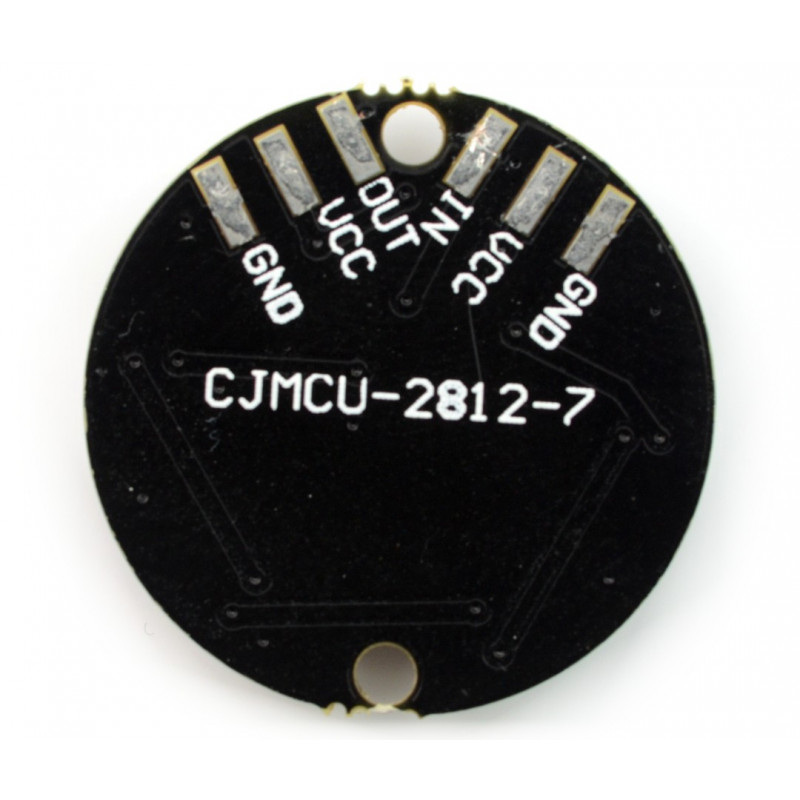

# Sezon 01 - lutowanie i miganie

Pierwsze zajęcia offlinie. Zaczeliśmy of rozdania prezentów :)

## Prezent

## Poruszone zagadnienia

### Lutowanie
- Jak poprawnie wykonywać luty
- Trening lutowania na [płytce uniwersalnej](https://github.com/CreativeCodingPL/PhysicalComputing/tree/2019/s01_pierwsza_dioda_i_prezenty#płytka-uniwersalna): wlutowanie przycisków, wlutowanie kabelków, wlutowywanie goldpin, łączenie ścieżek cyną, usuwanie nadmiaru cyny.
- ćwiczenie lutowania na modułach: wyświetlacz LCD, diody RGB, barometr, akcelerometr 
- Lutowanie kabli: odizolowanie i ocynowanie końca kabla
(To do: łączenie dwóch kabli)

### Maker UNO - malezyjskie Arduino, świetne!

Twórczo przetworzona oryginalna koncepcja Arduino, z przydatnymi  podczas nauki modyfikacjam. Dodatkowe 12 Led przy każdym pinie cyfrowym, dodatkowy przycisk na pinie 2, oraz głośniczek na pinie 8.

- [Detale techniczne i drivery](https://www.cytron.io/c-arduino/c-arduino-main-board/p-maker-uno-simplifying-arduino-for-education) 
- [Maker UNO: Simplifying Arduino for {Education}](https://makeruno.com.my)

- Wgrywanie kodu na Arduino, wygór kłytki, portu.
- Miganie diodami wlutowanymi w Maker Uno
- Beep! Beep!
- Pierścień LED RGB 7 x WS2812 5050

- Adafruit NeoPixel Library

## Materiały pomocnicze 
- [Soldering (cool!) video)](https://youtu.be/QKbJxytERvg)
- [Przewodnik lutowania z Adafruit](https://learn.adafruit.com/adafruit-guide-excellent-soldering)

## Schematy

Schemat połączeń przycisków zlutowanych na [płytce uniwersalnej](https://github.com/CreativeCodingPL/PhysicalComputing/tree/2019/s01_pierwsza_dioda_i_prezenty#płytka-uniwersalna)

# 
