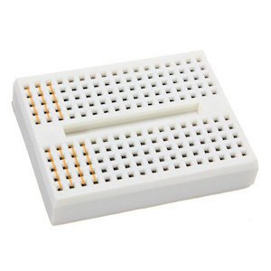

 

Wyświetlacz LCD 2x16 niebieski ze sterownikiem HD44780 - QC1602A

Czujnik HC-SR04 - ultradźwiękowy pomiar odległości 2-400 cm

Silnik z przekładnią 1:48 DC 6V oraz koło 65mm 

Płytka stykowa 170 pól - SYB-170 
Połączone w każdej kolumnie po pięć dziurek jak zaznaczone na pomarańczowo na zdjęciu powyżej.

