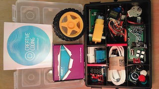

## Prezent

### Zestaw w całej okazałości 
Otrzymaliście na własność zestaw do eksperymentów na zajęciach i po zajęciach też :)

### Maker UNO - super malezyjskie Arduino
Twórczo przetworzona oryginalna koncepcja Arduino, z przydatnymi  podczas nauki modyfikacjam. Dodatkowe 12 Led przy każdym pinie cyfrowym, dodatkowy przycisk na pinie 2, oraz głośniczek na pinie 8.

- [Detale techniczne i drivery](https://www.cytron.io/c-arduino/c-arduino-main-board/p-maker-uno-simplifying-arduino-for-education) 
- [Maker UNO: Simplifying Arduino for {Education}](https://makeruno.com.my)

## Pozostałe komponenty w zestawie

 

### Wyświetlacz LCD 2x16 ze sterownikiem HD44780 - QC1602A
W starym dobrym stylu wyświetlanie dwóch lini tekstu po 16 znaków każda

### Czujnik ultradźwiękowy - HC-SR04  
Pomiar odległości 2 cm - 400 cm

### Silnik DC 6V z przekładnią 1:48 oraz koło 65mm 

### Płytka stykowa 170 pól - SYB-170 
Połączone w każdej kolumnie po pięć dziurek jak zaznaczone na pomarańczowo na zdjęciu powyżej.

### Czujnik ciśnienia i temperatury - GY-68 BMP180

### Radio 2.4GHz - nRF24L01 
Sterowanie SPI - Arduino

### Sterownik do silnika krokowego - ULN2003 V3
Opis

### Akcelerometr i żyroskop 3-osiowe XYZ - MPU-6050 i GY-521
Opis

### Sterownik L9110 do silników DC - HG7881
Opis

### Czujnik dźwięku - LM393
Detektor hałasu i mikrofon

### Wyświetlacz LED 4 cyfry ze sterownikiem - TM1637
Opis

### Czujnik optyczny szczelinowy - LM393
Szczelina o szerokości 5mm. , enkoder, transoptor

### Fotorezystor 10k-20k - GL5528
Średnica 5mm, LDR 5528

### Ładowarka sieciowa USB 5V + Przewód Micro USB 
Zasilanie układu bez komputera - samo działa :)

### Dioda laserowa czerwona
Napięcie pracy: 5V 
Długości światłą: 650nm 
Moc: 5mW - uwaga na oczy!

### Przewody 
20cm - męsko-żeńskie, w taśmie
10cm - męsko-żeńskie, w taśmie
20cm - męsko-męsko luzem

### LED RGB 5050 sterownik WS2812 - CJMCU2814
Opis

### Czujnik odbiciowy
Wykrywa przeszkody w zakresie od 0,2cm do 60cm

### Płytka uniwersalna 30x70mm - PI22Z - dwustronna - PCB budowa prototypów
Opis

### Przekaźnik 5V na 250V / 10A
Sterowanie za pomocą Arduino urządzeniami zasilanymi z kontaktu.

### Silnik krokowy - 24BYJ48-N08W
Napięcie: 5V
64 kroki na pełen obrót
4-fazowy
Przekładnia 1:64

### Przycisk chwilowy
Przycisk o wymiarach 12x12x7,3mm.  Ma 4 pin. Wciśniecie zwiera piny bliższe siebie (tak samo po dwóch stronach). Wystarczyłby 2 piny, ale są 4 żeby lepiej trzymało się płytki :)

### tytuł
Opis

### tytuł
Opis

### tytuł
Opis
