# Sezon 02 - biblioteki, serial, głośnik, fotorezystor, serwo

W ramach zajęć eksplorowaliśmy zagadnienia związane z obługą Arduino, w tym komunikacją po `Serial`, używaniem bibliotek oraz obługą fotorezystora, serwo i głośnika.    

## Poruszone zagadnienia:

- jak instalować biblioteki?
- jak działa `Serial`?
- fotorezytor i `INPUT_PULLUP`
- serwo
- naśladowanie ruchu - serwo + fotorezystor
- głośnik, tone
- prosty instrument - głośnik + fotorezystor

### Jak instalować biblioteki?

W nowszej wersji `Arduino IDE` (np. 2.x), biblioteki instalujemy za pomocą `Library Manager`, który jest dostępny jako ikona (książki) po lewej stronie interfejsu programu.

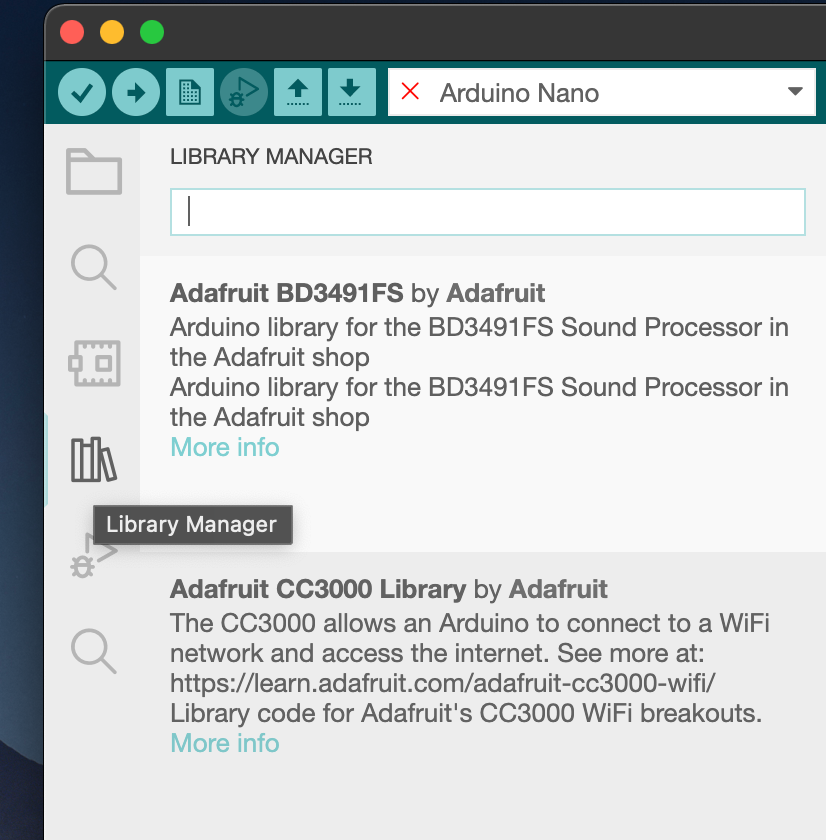

Następnie wpisujemy nazwę biblioteki (np. servo) i wybierając określoną wersję (zazwyczaj najnowszą, na screenie 1.1.7) klikamy `Install`.

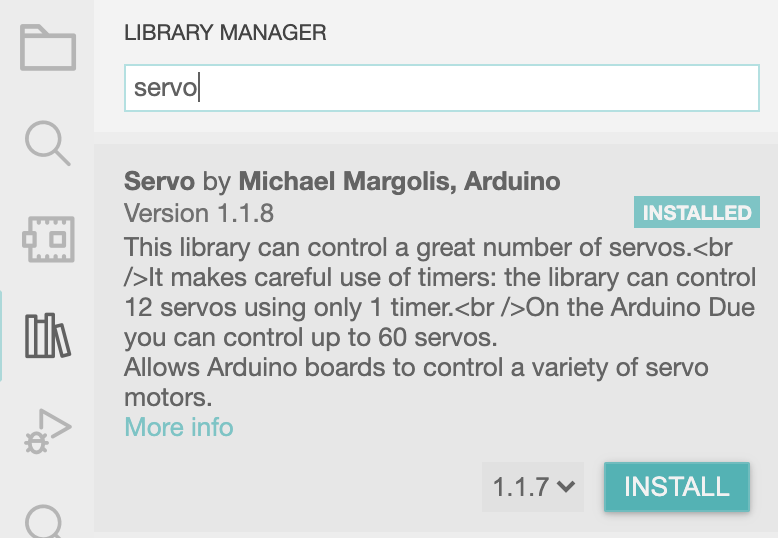

W starszej wersji `Arduino` (np. 1.x) biblioteki instalujemy z menu programu.  

```text
Sketch → Include library → Manage Libraries...
```

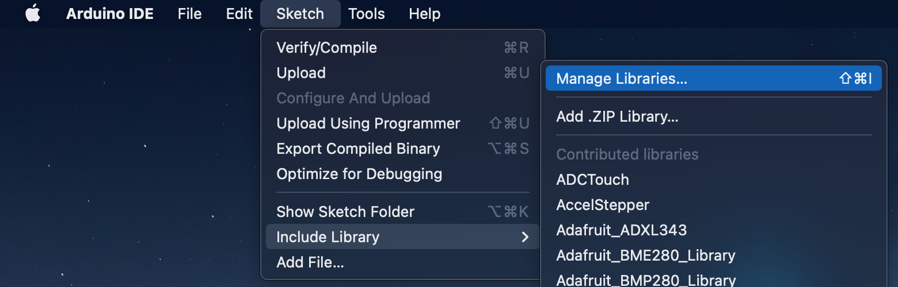

Następnie wyszukujemy nazwę biblioteki (np. servo), wybieramy wersję i klikamy `Install`.

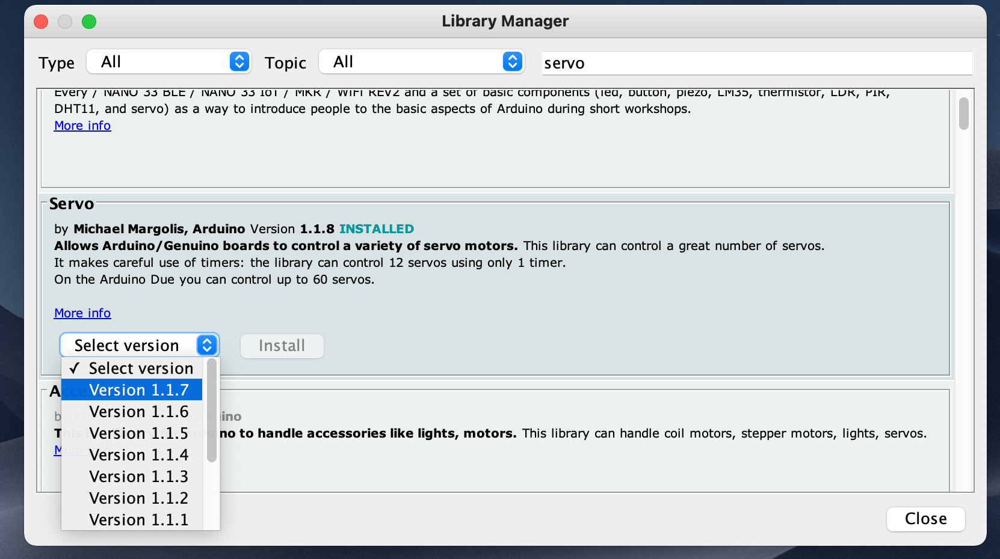

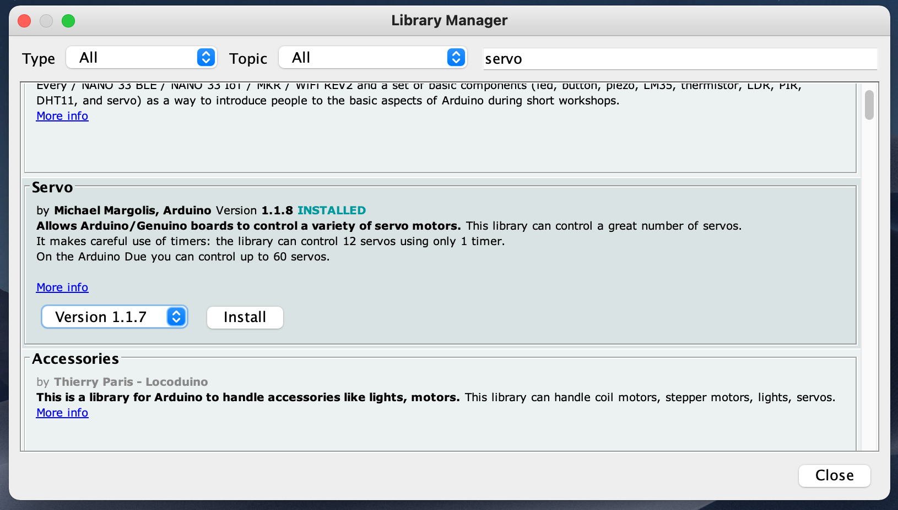

Od tego momentu możemy dodwać biblioteki do pisanych przez nas programów, wskazując wybraną bibliotekę z menu:

```text
Sketch → Include library → Servo
```

Dzięki temu do naszego programu zostanie dodana instrukcja, która umożliwi użycie wskazanej biblioteki

```cpp
#include <Servo.h>
```

### Jak działa `Serial`?

`Serial` służy do przesyłania i odbierania informacji do i z komputera. Wystarczy połączyć komputer z Arduino używając kabel USB (ten sam, który używany jest podczas programowania).

Aby transmisja przebiegała prawidłowo, musi zostać ustawiona ta sama prędkość przesyłu danych (baud-rate, np. `9600`). Określa ona ilość transmitowanych bitów na sekundę.

Arduino (w wesji Una, Nano, Mini) do komunikacji używa następujących pinów:

- `Pin 0` (`RX`) - odbierania danych
- `Pin 1` (`TX`) - wysyłania danych

Wersje Arduino Mega czy Due posiadają dodatkowe piny pod `Serial`, np. `Serial1` - 19 (RX) i 18 (TX). 

```cpp
void setup() {

  // Otwarcie portu i ustawienie prędkości na 9600 bitów na sekundę.
  Serial.begin(9600);
}

void loop() {

  // Pomiaru czasu.
  unsigned long time = millis();  

  // Wypisywanie zmiennej `time` w nowym wierszu.
  Serial.println( time );
}
```

Używając `Serial Monitor` możemy podglądać, jakie informacje są przesyłane.

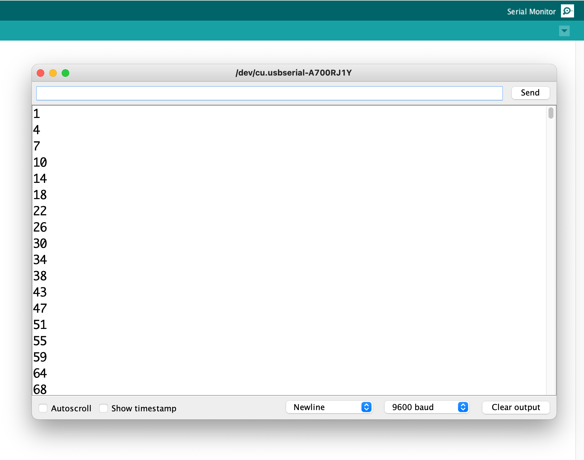

W starszej wersji `Arduino` (1.x) `Serial Monitor` jest wyświetlany w nowym oknie. Nowsza wersja (2.x) `Arduino IDE` udostępnia informacje w dolnej części programu.

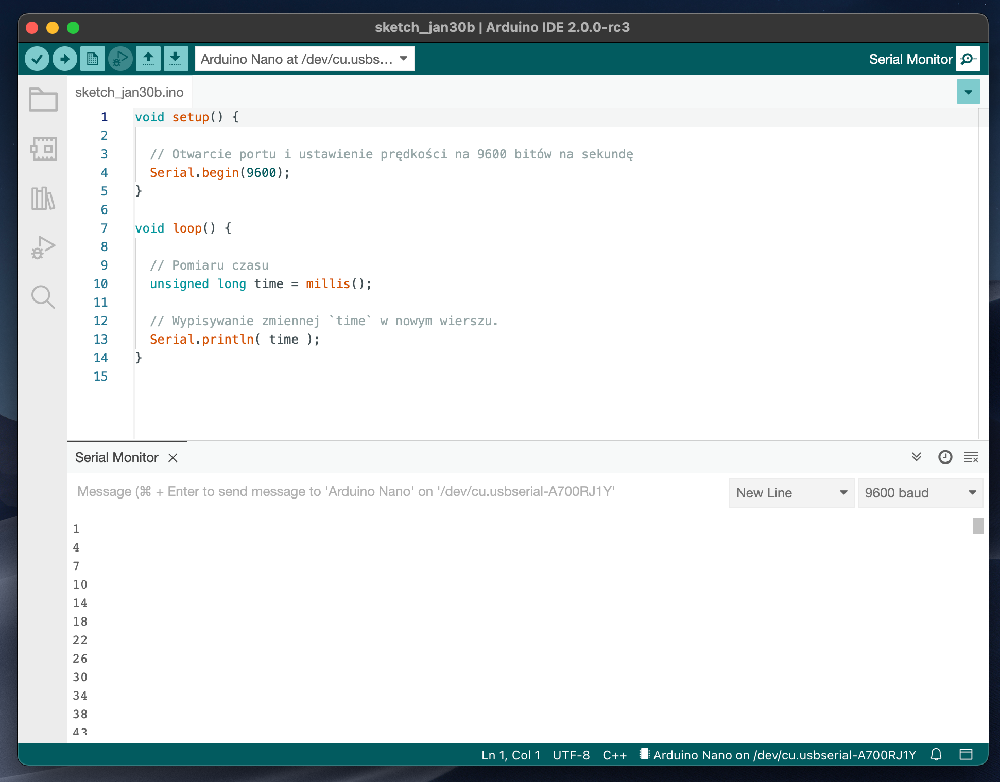

### Fotorezytor i `INPUT_PULLUP`

[Fotorezystor](https://github.com/CreativeCodingPL/PhysicalComputing/tree/2021/#fotorezystor) to prosty czujnik natężenia światła.

Podłączamy go używając wewnętrznego rezystora, który włączamy za pomocą kodu (`INPUT_PULLUP`).

```cpp
pinMode(A0, INPUT_PULLUP);
```

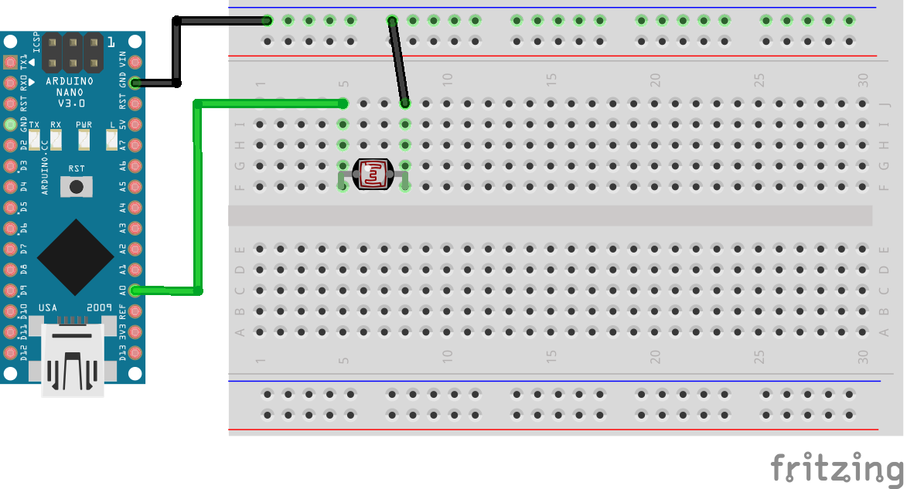

Uzyskane informacje na temat natężenia światła możemy użyć jako dane dla innych sensorów, np. diody.

Możemy za pomocą natężenia światła np. sterować jasnością diody.

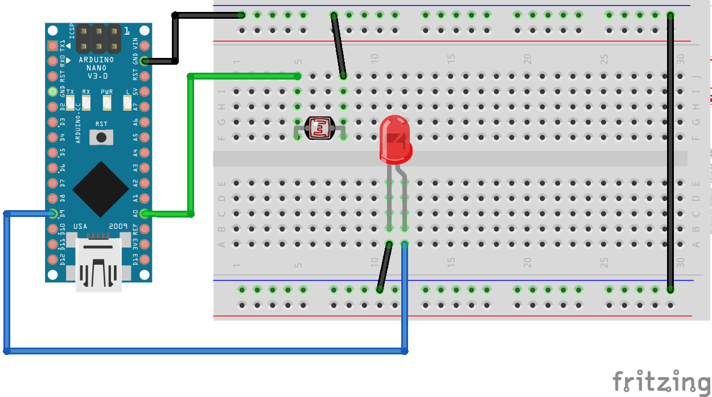

### Serwo

Serwomechanizm to silnik, przekładnia oraz dedykowany sterownika zamknięty w jednej obudowie. 
Serwo najczęściej porusza zamontowanym ramieniem o kąt 0-180º. 
Co ważne, serwomechanizmy znają swoją aktualną pozycję.

Z każdego serwomechanizmu wyprowadzone są 3 przewody:

- Masa (czarny, ciemnobrązowy)
- Zasilanie (czerwony)
- Sygnał sterujący (żółty/pomarańczowy)

W zależności od producenta kolory przewodów mogą się różnić. Jednak dwa na pewno będą zbliżone do czarnego i czerwonego (zasilanie). 
Pozostały, trzeci będzie przewodem sygnałowym.

UWAGA: Nie powinno się zasilać serwomechanizmu bezpośrednio z tego samego napięcia, które zasila mikrokontroler, gdyż silnik może pobierać duży prąd - zatem powinniśmy podłączyć go do układu posiadającego odpowiednio wydajne źródło napięcia.

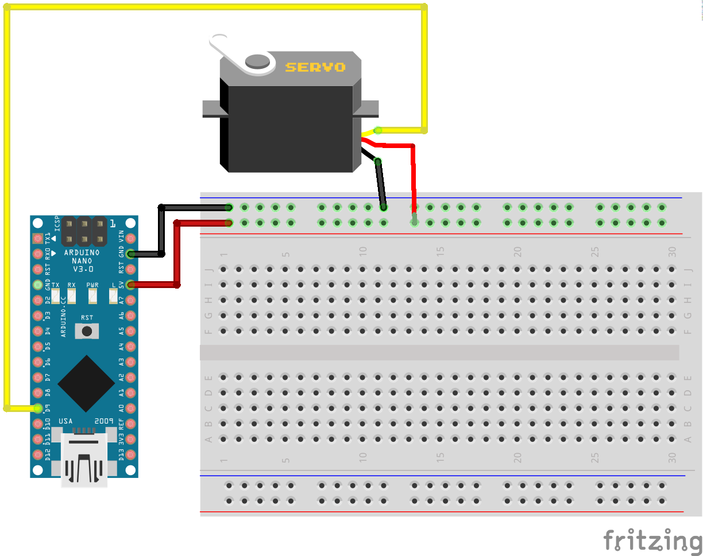

Aby użyć serwo musimy dodać bibliotekę, która umożliwia sterowanie serwomechanizmem.
Następnie wystarczy podać pozycję (kąt) do jakiej ma obrócić się serwomechanizm.

```cpp
#include <Servo.h>

Servo serwo;

void setup() {
  serwo.attach(9); // 9 to pin D9 strujący sygnałem (żółty/pomarańczowy)
}

void loop() {
  serwo.write(0);
  delay(1000);
  serwo.write(180);
  delay(1000);
}
```

### Naśladowanie ruchu - serwo + fotorezystor

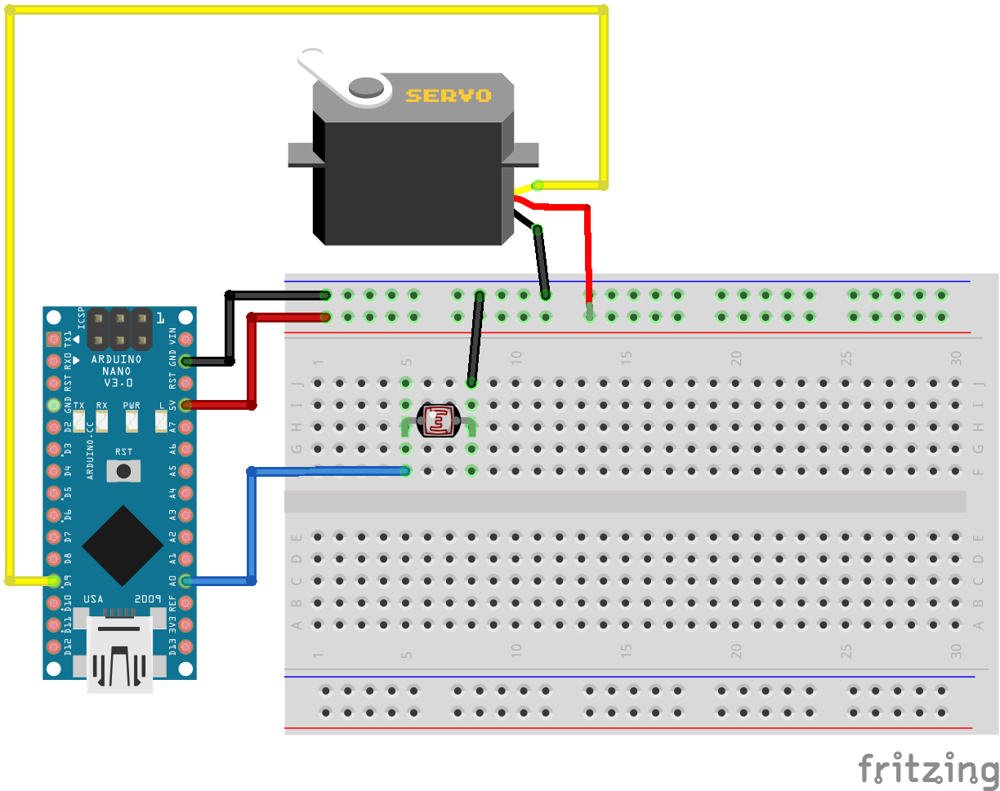

### Głośnik, tone

Najprostszym rozwiązaniem jest podłączenie głośniczka bezpośrednio do wyjścia cyfrowego.
Ze względu na ograniczenie 40 mA na wyjściu cyfrowym Arduino, jest to bezpieczne dla głośniczka, nawet bez żadnego rezystora.

Funkcja `tone()` generuje falę prostokątną na zadanym pinie. 
Długośc trwania może zostać zadana (jako parametr), w przeciwnym razie funkcja działa do momentu wywołania `noTone()`.

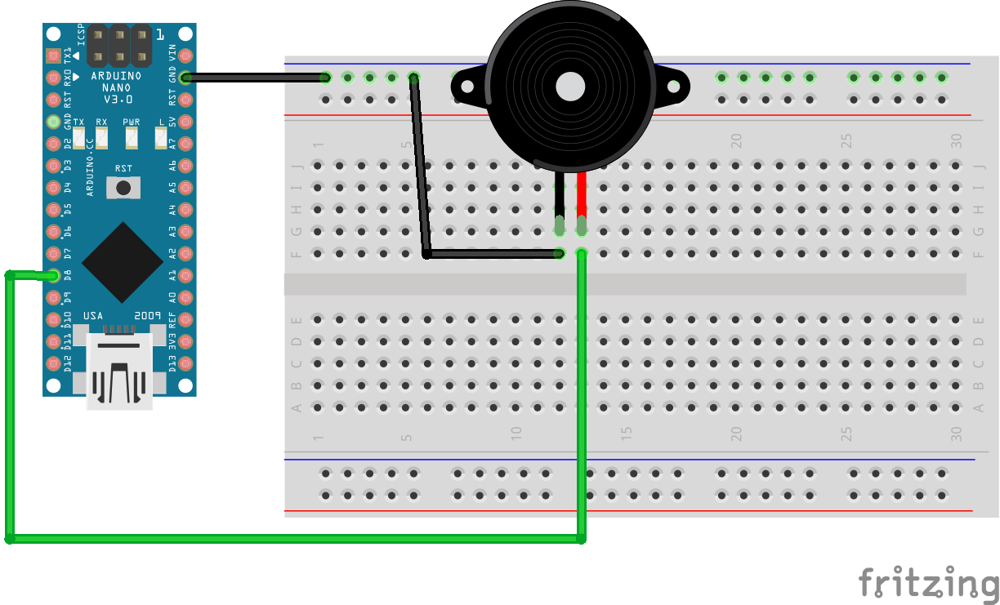

### Prosty instrument - głośnik + fotorezystor 

Finalnie stworzyliśmy prosty instrument, gdzie sterowanie dźwiękiem odbywa się za pomocą natężenia światła.

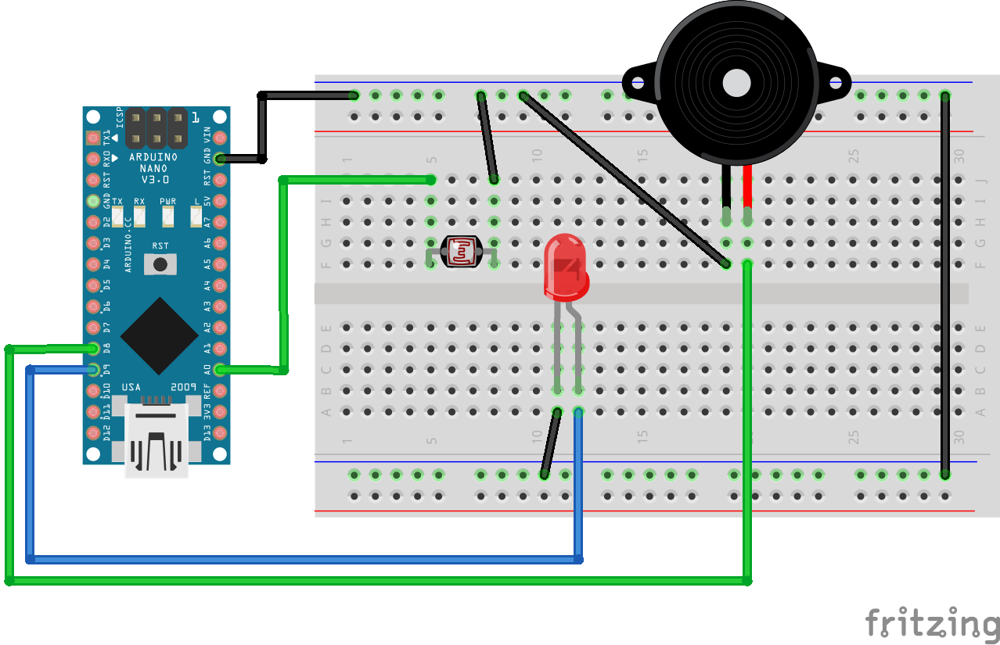

## Materiały pomocnicze

- [Biblioteki](https://www.arduino.cc/reference/en/libraries/)
- [Serial](https://www.arduino.cc/reference/en/language/functions/communication/serial/)
- [Servo](https://www.arduino.cc/reference/en/libraries/servo/)
- [Pulse Width Modulation - PWM](https://docs.arduino.cc/learn/microcontrollers/analog-output)
- [tone()](https://www.arduino.cc/reference/en/language/functions/advanced-io/tone/)
