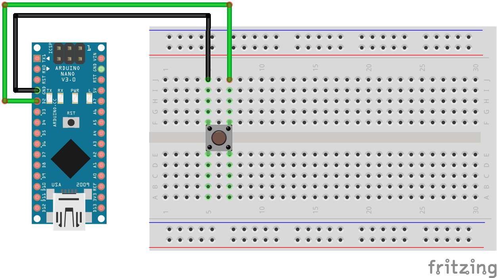
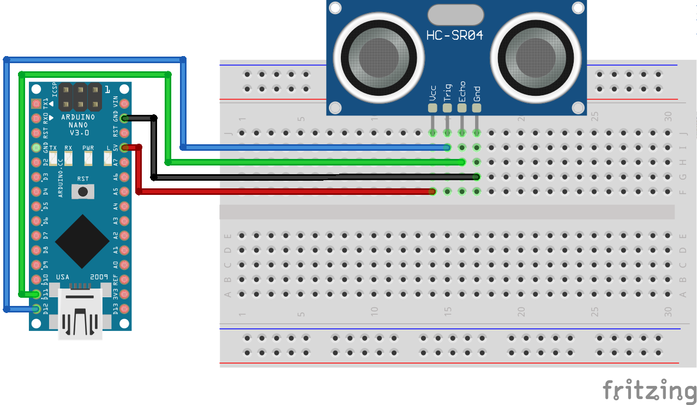

# Sezon 03 - przycisk, pomiar odległości, millis

W ramach zajęć eksplorowaliśmy użycie `millis()`, przycisku oraz sonaru.    

## Poruszone zagadnienia:

- przycisk
- odmierzanie czasu - `millis()`
- wykrywanie odległości od obiektów
- ruch - sonar + ledy
- ruch - sonar + serwo

### Przycisk

Przycisk (zwany też button'em lub switch'em) zbudowany jest z dwóch blaszek. 
Kiedy go wciśniemy, to obwód się zamknie (blaszki będą się stykały), co umożliwi przepływ prądu.



Gdy nic nie robimy z przyciskiem, to do Arduino odczytuje wartość `LOW`, a gdy go wciśniemy — sygnał zmienia się na przeciwny, czyli `HIGH`.

**UWAGA!** Gdy używamy `pinMode()` jako `INPUT_PULLUP`, wówczas logika jest odwrócona. 
To znaczy, gdy nic nie robimy jest `HIGH`, a po wciśnięciu jest `LOW`.

```cpp
void setup() {
  pinMode(2, INPUT_PULLUP);
}

void loop() {
  int wartosc = digitalRead(2);
  
  if (wartosc == HIGH) {  
    // nic nie robimy
  } else {
    // przycisk jest wduszony
  }
}
```

### Odmierzanie czasu - `millis()`

Chcąc wykonać pomiar czasu możemy użyć funkcji `millis()`. 
Zwraca ona liczbę milisekund, która upłynęła od momentu podłączenia Arduino do prądu.

Każda sekunda, to `1000 ms`. By zmienna, która przechowuje informację o czasie mogła pomieścić dużą wartość, stosujemy typ danych typu `unsigned long`.

```cpp
unsigned long aktualnyCzas = millis();
```

### Wykrywanie odległości od obiektów

Czujnik odległości (HC-SR04) składa się z nadajnika i odbiornika ultradźwięków.
Wysła on falę dźwiękową i oblicza czas potrzebny do powrotu do czujnika.
W ten sposób wiemy, jak daleko od czujnika znajduje się obiekt.

Czujnik posiada czterech piny.
Dwa z nich służą do zasilania układu (VCC i GND), a drugie dwa (Trig i Echo) do wykonywania pomiarów.

Maksymalny zasięg tego układu, deklarowany przez producenta, wynosi 4 m.



```cpp
#include <NewPing.h>

// VCC > 5V
// D11 > Echo
// D12 > Trig
// Gnd > Gnd

NewPing sonar(12, 11, 20);

void setup() {
  Serial.begin(9600);
  pinMode(13, OUTPUT);
}

void loop() {
  int odleglosc = sonar.ping_cm();

  Serial.println(odleglosc);
  delay(50);
}
```

## Materiały pomocnicze

- [Przycisk](https://www.arduino.cc/en/Tutorial/BuiltInExamples/Button)
- [NewPing](https://www.arduino.cc/reference/en/libraries/newping/)
- [Servo](https://www.arduino.cc/reference/en/libraries/servo/)
- [millis()](https://www.arduino.cc/reference/en/language/functions/time/millis/)
