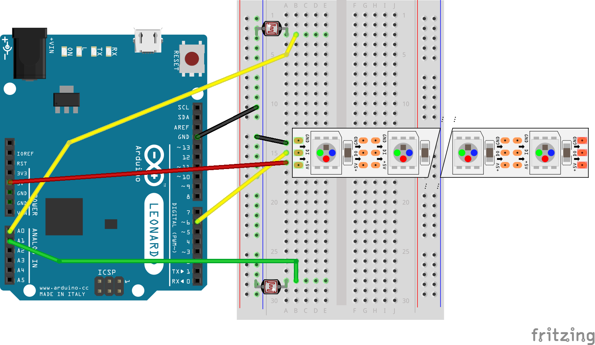

# Sezon 03 :: NeoPixele na choinkę :christmas_tree: 

## Poruszone zagadnienia

### NeoPixels RGBW
- diody sterowane za pomocą jednego pinu. Każda dioda ma wbudowany swój własny mikrokontroler (driver) WOW!
- Każda dioda ma trzy barwy składowe R, G, B, oraz dodatkową diodę białą (W)! Stąd RGBW.
- strip.begin(), strip.show() 
- strip.setPixelColor(), 
- strip.Color(R, G, B, W)

### Potencjometr
- rezystor o zmiennym oporze, zależnym od ustawienia konta na pokrętle

## Praca domowa
Spokojnych Świąt i zabawy prezentami :)

## Przydatne linki
- [DESIGN YOUR CIRCUIT WITH CIRCUITO.IO](https://www.circuito.io)
- [Fritzing - document prototypes](http://fritzing.org/home/)
- [AdaFruit Fritzing Library](https://github.com/adafruit/Fritzing-Library)
- [The Magic of NeoPixels - Adafruit NeoPixel Überguide](https://learn.adafruit.com/adafruit-neopixel-uberguide/the-magic-of-neopixels)

## Schematy

### e04_wedrowiecPokretlo

### e05_wedrowcyDwajFoto

