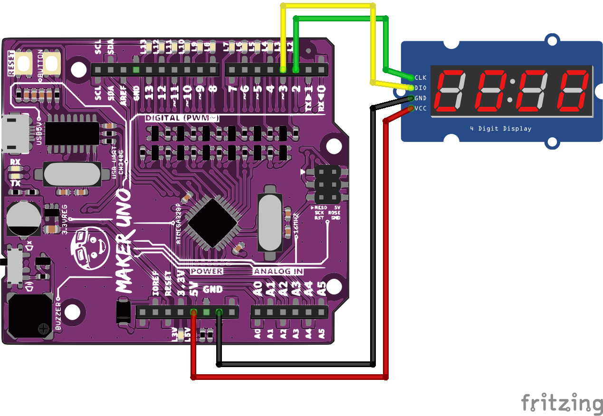

# Sezon 03 :: Display 7seg i czujnik PING

## Poruszone zagadnienia

### [Czujnik ultradźwiękowy](https://github.com/CreativeCodingPL/PhysicalComputing/tree/2019/s01_pierwsza_dioda_i_prezenty#czujnik-odbiciowy) - HC-SR04

- Ultradźwiękowy pomiar odległości 2 cm - 200 cm. 
- Instalacja biblioteki `NewPing`
- `NewPing sonar(trig, echo, max_distance);` tworzy obiekt `sonar` obsługujący czujnik. Podajemy piny do których podłączone są `TRIG` i `ECHO`, oraz ustalmy maksymalny zakres pomiarowy w centymetrach.
- `sonar.ping_cm();` odczytujemy aktualny pomiar odległości w centymetrach.

### [4 x wyświetlacz 7 segmentowy LED](https://github.com/CreativeCodingPL/PhysicalComputing/tree/2019/s01_pierwsza_dioda_i_prezenty#wyświetlacz-led-4-cyfry)

- Wyświetla cyfry, ale też można robić efekty specjalne, glitch itp. 
- Instalacja biblioteki `TM1637Display`.
- `TM1637Display display(CLK, DIO);` tworzy obiekt `display` do obsługi wyświetlacza. Podajemy do jakich pinów podłączyliśmy `CLK` i `DIO`.
- `uint8_t segments[][4] = {…}` tablica opisująca, które segmenty mają być zapalone. Kolejne wiersze tablicy, to kolejne układy zapalonych segmentów. A potem pokazujemy po kolei i tak powstaje animacja.
- `display.setBrightness(255);` ustala jasność świecenia
- `display.setSegments(segments[i]);` zapala segmenty na podstawie danych z i-tego wiersza tablicy. W tablicy 4 liczy opisujące stan każdego z 4 wyświetlaczy składających się na cały układ. Więcej o tym w materiałach pomocniczych. 
- `display.showNumberDec(x, true);` wyświetla liczbę `x` poprzedzoną zerami jak podamy `true` lub bez zer jak podamy `false`.

## Materiały pomocnicze 
- [Seven-segment display](https://en.wikipedia.org/wiki/Seven-segment_display)
- [How an Arduino Ultrasonic Sensor Works](https://youtu.be/1jGvzNrtF24)

## Schematy

### PING

### Display

