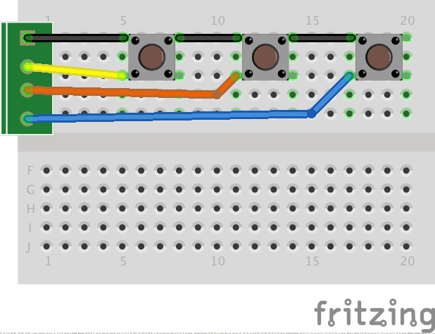

# Sezon 03 :: Lutowanie 

## Poruszone zagadnienia

### Lutowanie
- Jak poprawnie wykonywać luty
- Trening lutowania na [płytce uniwersalnej](https://github.com/CreativeCodingPL/PhysicalComputing/tree/2019/s01_pierwsza_dioda_i_prezenty#płytka-uniwersalna): wlutowanie przycisków, wlutowanie kabelków, wlutowywanie goldpin, łączenie ścieżek cyną, usuwanie nadmiaru cyny.
- ćwiczenie lutowania na modułach: wyświetlacz LCD, diody RGB, barometr, akcelerometr 
- Lutowanie kabli: odizolowanie i ocynowanie końca kabla
(To do: łączenie dwóch kabli)

## Materiały pomocnicze 
- [Soldering (cool!) video)](https://youtu.be/QKbJxytERvg)
- [Przewodnik lutowania z Adafruit](https://learn.adafruit.com/adafruit-guide-excellent-soldering)

## Schematy

Schemat połączeń przycisków zlutowanych na [płytce uniwersalnej](https://github.com/CreativeCodingPL/PhysicalComputing/tree/2019/s01_pierwsza_dioda_i_prezenty#płytka-uniwersalna)

