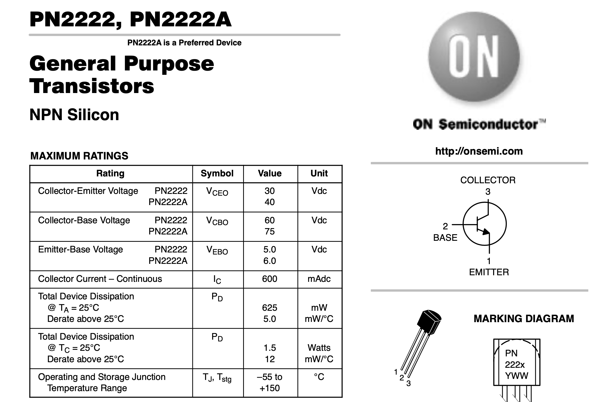
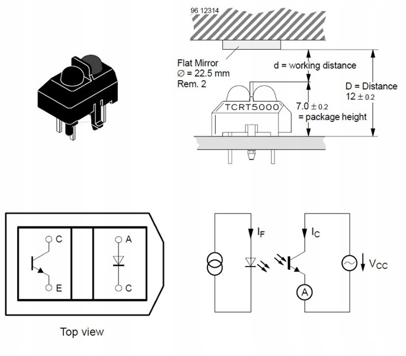
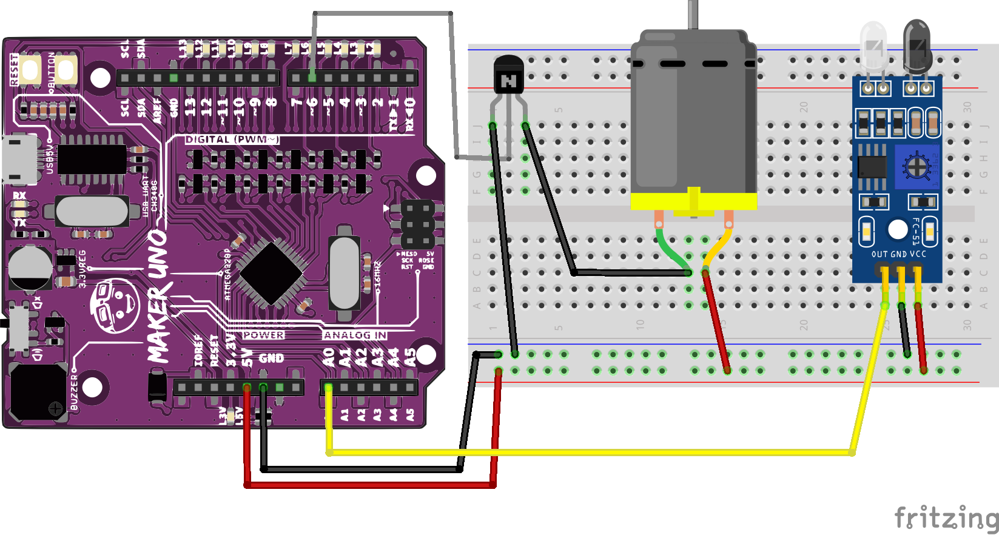

# Sezon 05 :: Tranzystor, silnik DC, stepper motor i czujnik odbiciowy

### Tranzystor NPN typu 2N222

Jak czytać dokumentację opisującą parametry danego elementu elektronicznego na przykładzie tranzystora. Tu ważne parametry to maksymalne dopuszczalne napięcia i prądy. Np. Prąd wynosi 620 mA, to akurat dla naszego silnika DC, z pinu by nie poszło, bo one dają max 40 mA, a niektóre nawet tylko 20 mA (tyle żeby diodę zaświecić).

Fragment dokumentacji tranzystora

Więcej o tranzystorze
- [Transistors, How do they work?](https://youtu.be/7ukDKVHnac4)
- [NPN Tranzystor typu 2N222 lub PN2222 - Dokumentacja](http://users.ece.utexas.edu/~valvano/Datasheets/PN2222-D.pdf)

### Sterowanie silnikiem DC za pomocą tranzystora

Pin ma za mały prąd, więc używamy tranzystora jako sterownika (drivera), który może dostarczyć więcej prądu. Nasz 2N222 daje 620 mA, a silnik pobiera nie więcej niż 500 mA. Tu wszystko znajdziecie w dokumentacji producenta :)

Połączanie tranzystora z silnikiem i Arduino

Zmiana prędkości silnika kontrolowana [czujnikiem odbiciowym](https://github.com/CreativeCodingPL/PhysicalComputing#czujnik-odbiciowy)

Co siedzi w czujniku odbiciowym

Dodanie czujnika do układ z silnikiem i tranzystorem

 
### Poruszanie silnikiem krokowym

Silnik ustawia się pod zadanym w kodzie kątem. Dokładność jest zależna od trybu: **AccelStepper::FULL4WIRE** - *szybciej, ale mniej dokładnie* lub **AccelStepper::HALF4WIRE** - *wolniej, ale dokładniej*. Ten model silnika (24BYJ48-N08W) pokonuje 360 stopni (jeden obrót) w 32 krokach. Przekładnia 64:1. Czyli przy **HALF4WIRE** po naszemu półkroki na pełen ogród potrzebuje 2*32 kroki. Razy, z przekładnią daje to 64*64=4096 kroki na pełen obrót, czyli najmniejszy możliwy ruch kątowy wynosi 360/4096 = 0.088 stopnia = wow duża precyzja. Do kontroli silnika krokowego używamy biblioteki [AccelStepper](http://www.airspayce.com/mikem/arduino/AccelStepper/classAccelStepper.html).

[Wideo - Jak działa silnik krokowy na przykładzie 28BYJ-48](https://youtu.be/B86nqDRskVU)

Połączenie silnika krokowego ze sterownikiem i Arduino 
 

## Materiały pomocnicze ekstra
Na waszą specjalną prośbę o prądzie, napięciu, mocy i oporze.

- [Prąd i napięcie](https://youtu.be/_-Oy_O-Hcis)
- [Rezystory, czyli oporniki](https://youtu.be/6ZOm7t-de4E)
- [Kondensator](https://youtu.be/CjStHxRmxPM)
- [Silniki elektryczne](https://youtu.be/t5udd52l1WA)
- [Tranzystor](https://youtu.be/OEPqjQ9PI1M)