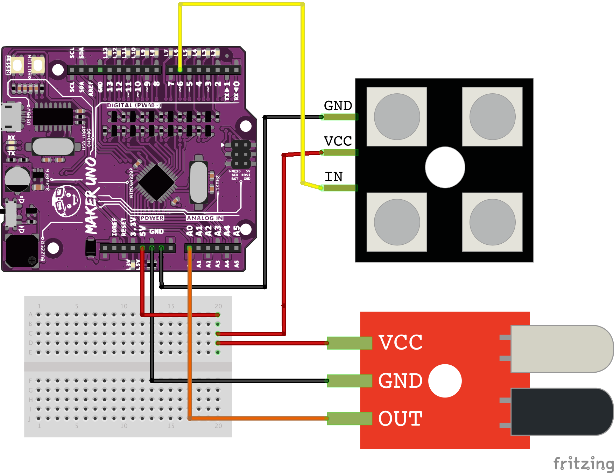

# Sezon 05 :: NeoPixele i czujnik odległości IR

## Poruszone zagadnienia

### NeoPixels RGB
- diody sterowane za pomocą jednego pinu. Każda dioda ma wbudowany swój własny mikrokontroler (driver) WOW!
- Każda dioda ma trzy barwy składowe R, G, B, Stąd RGB. Są też z dodatkową diodą białą (W)! Wtedy RGBW. U nas zamieniona jest kolejność, czyli mamy diodę GRB. Dlatego na początku piszemy `Adafruit_NeoPixel pixels(NUMPIXELS, NEOPIXEL_PIN, NEO_GRB + NEO_KHZ800);`
- `pixels.begin();` aktywuje bibliotekę
- `pixels.show();` aktualizuje stan diod
- `pixels.clear();` gasi wszystkie diody
- `pixels.setPixelColor(i, R, G, B);` ustawia kolor diody `i` na podstawie podanych składowych `R, G, B`. 
- `pixels.Color(R, G, B);` tworzy kolor, który można zapisać w jednej zmiennej.

### [Czujnik odbiciowy](https://github.com/CreativeCodingPL/PhysicalComputing/tree/2019/s01_pierwsza_dioda_i_prezenty#czujnik-odbiciowy) - IR Sensor odległości
- Ocenia odległość oświetlając obiekty światłem podczerwonym (dioda IR) i sprawdzając natężenie odbytego światła (dioda foto-czuła IR). Orientacyjny zakres odległości: 0,2 cm - 60 cm. 

## Materiały pomocnicze 
- [The Magic of NeoPixels - Adafruit NeoPixel Überguide](https://learn.adafruit.com/adafruit-neopixel-uberguide/the-magic-of-neopixels)
- [Fritzing - document prototypes](http://fritzing.org/home/)
- [AdaFruit Fritzing Library](https://github.com/adafruit/Fritzing-Library)
- [DESIGN YOUR CIRCUIT WITH CIRCUITO.IO](https://www.circuito.io)

## Schematy

### neopixel_irSensor

