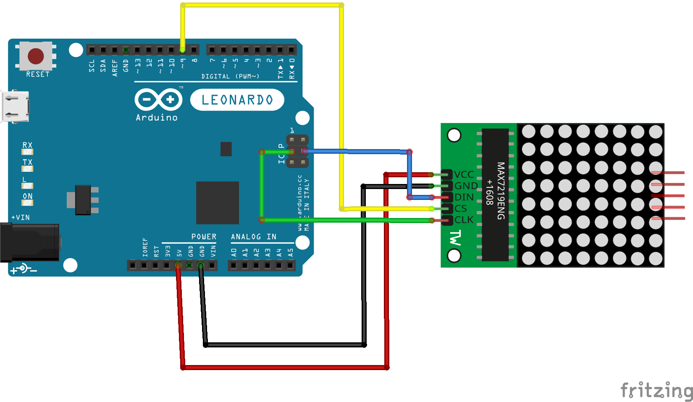

# Sezon 06 :: Lutowanie i matrix max7219

## Poruszone zagadnienia

### Lutowanie
- Jak poprawnie wykonywać luty
- Trening lutowania na proto płytkach: wlutowanie kabelków, wlutowywanie goldpin, usuwanie nadmiaru cyny.
- ćwiczenie lutowania zestawów: wyświetlacz led matrix 8x8 z kontrolerem max7219.

//to do: odizolowanie i ocynowanie końca kabla, łączenie dwóch kabli, odsysanie cyny przy wlutowywaniu.

### Wprowadzone nowe polecenia, typy, biblioteki i inne elementy
- biblioteka LEDMatrixDriver  
- setPixel(x, y, s); zapalanie led na pozycji x,y. Jak s true to pali, jak nie to gasi.
- delayMicroseconds(); opóźnienie w mikro sekundach (milionowych sekundy)

## Praca domowa
Brak

## Materiały pomocnicze 
- [Przewodnik lutowania z Adafruit](https://learn.adafruit.com/adafruit-guide-excellent-soldering)
- [Soldering (cool!) video)](https://youtu.be/QKbJxytERvg)
- [Zestaw matryca led ze sterownikiem](https://botland.com.pl/wyswietlacze-led/1887-matryca-led-8x8-sterownik-max7219-mala-32x32mm.html)
- [Biblioteka LEDMatrixDriver](https://github.com/bartoszbielawski/LEDMatrixDriver)

## Schematy

### Do wszyskich przykładów, jak podłączyć Arduino z kontrolerem max7219

