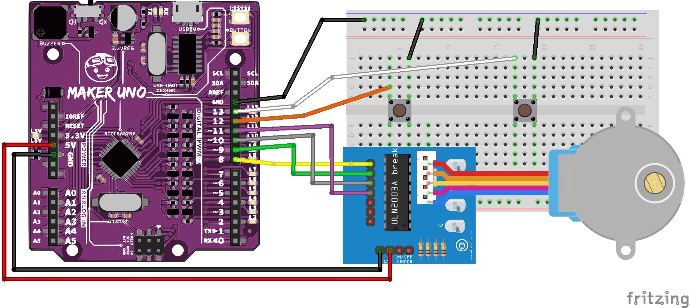
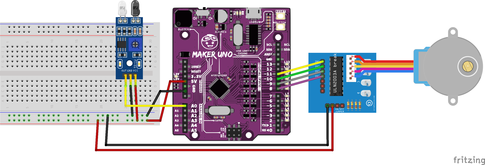

# Sezon 06 - stepper przyciski i pozycjonowanie czujnikiem

### Przyciski (buttons)  

Jak podłączyć przycisk używając wewnętrznego rezystora ustalającego stan wejścia na HIGH. 

Wystarczy podłączyć jak na schemacie, ale pamiętając by włączyć w kodzie wewnętrzny rezystor poleceniem `pinMode(13, INPUT_PULLUP);`

Częsty błąd polega na tym, że przycisk podłączany jest jak na schemacie bez PULLUP, wtedy stan wejścia jest domyślnie INPUT, co oznacza, że nie ma stanu domyślnego. Wtedy jak przycisk nie jest wciśnięty stan wejścia jest nie ustalony. Może być LOW, HIGH lub przypadkowo zmieniać się pomiędzy tymi stanami!!!

Różne warianty kodu do tego `e01_button_xx`

### Poruszanie silnikiem krokowym przyciskami (button)

Najpierw jednym przyciskiem sprawiamy, że silnik kręci się po zatrzymaniu: z powrotem lub dalej. W przykładzie `e02_button_stepper_03_natychmiast` przycisk powoduje że kręci się dopóki przycisk jest wciśnięty. 
 

Podłączamy drugi przyciski i sterujemy dwoma przyciskami obrót zgodnie z ruchem wskazówek zegara lub odwrotnie. Kod `e03_button_x_2_stepper_04`.

### Silnik krokowy pozycjonuje wskazówkę 

Ustalamy początkowe położenie wskazówki za pomocą czujnika obiciowego. Kod `e04_stepper_sensor_00` zatrzymuje wskazówkę nad czujnikiem. Schemat układu jak poniżej.

Następnie zmieniamy kod tak, by po znalezieniu początku, wskazówka wykonała ustaloną sekwencję ruchów. Kod `e04_stepper_sensor_00_set_go`. Schemat bez zmian.

I jeszcze uporządkowany i z dodanymi ekstra komentarzami przykład nowy `e04_stepper_sensor_01_set_go_pro`. Do tego przykładu zmienia się też schemat, zamieniałem kolejność kabli żeby się nie plątały na rysunku, to wymagało zmiany w kodzie :). Nowy schemat poniżej. 

## Kod

Do poruszania używamy biblioteki `AccelStepper`. Tworzymy obiekt o nazwie `stepper` klasy `AccelStepper`. Poniżej metody, które używamy do poruszania stepperem
- `stepper.move(50);` motor wykonuje 50 kroków, startując od bieżącej pozycji, w kierunku zgodnym z ruchem wskazówek zegara, dla -50 przeciwnie do ruchu zegara (tak ładniej, ale do tego musiałem zmienić kod jak w przykładzie `e04_stepper_sensor_01_set_go_pro`). 

 - `stepper.setMaxSpeed(1500);` ustala maksymalną prędkość silnika na 1500 kroków na sekundę.
- `stepper.setAcceleration(3000);` ustala maksymalne przyspieszenie silnika na 3000 kroków na sekundę w każdej sekundzie (s^2).
- `stepper.distanceToGo()` zwraca liczbę kroków jaka jeszcze została do pokonania, by osiągnąć ustaloną ostatnio pozycję. Zwraca 0 jak pozycja jest osiągnięta.
- `stepper.moveTo(stepper.currentPosition()+50);` robi dokładnie to samo co `stepper.move(50);`
- `stepper.moveTo(150);` ustala pozycją docelową silnika na krok 150 licząc od początku ruchu (bezwzględnie). Czyli jeżeli aktualna pozycja jest 40 to wykona 110 kroków, a jak aktualna pozycja jest 220 to wykona -70. 
- `stepper.currentPosition()` podaje aktualną pozycję silnika liczoną w krokach od początku ruchu (włącznie Arduino do prądu lub resetu).
- `stepper.run();` zawsze musi pojawić się w loop(), powoduje, że wykonane jest obliczenie czy i o ile kroków w danym obrocie loop() ma się poruszyć silnik. Aktualizuje też wszystkie obliczenia, jak aktualną pozycję, prędkość, przyspieszenie itp.

## Praca domowa!!

Podłączcie jednocześnie dwa steppery i czujnik odbiciowy. Najpierw pierwszy stepper znajduje początek po czym przesuwa swoją wskazówkę, tak by drugi mógł znaleść początek. Potem steppery poruszają jednocześnie wskazówkami, tworząc rodzaj choreografii. Uważajcie, żeby wskazówki na siebie nie wpadały :)

Dla zachęty podpowiedź jak podłączyć dwa steppery :D

[Wideo pokazujące efekt końcowy](stepper_dwa_dom.mp4)

Rozwiązanie w pliku `e05_steppery_dwa_pro_domowa` na zasadzie powielenia tego co najzajęciach i optymalna wersja w pliku `e05_steppery_dwa_pro_simple_domowa`

## Materiały pomocnicze

Wyczerpujący opis zasady działania steppera typu 28byj48: 
[Control 28BYJ-48 Stepper Motor with ULN2003 Driver & Arduino](https://lastminuteengineers.com/28byj48-stepper-motor-arduino-tutorial/)