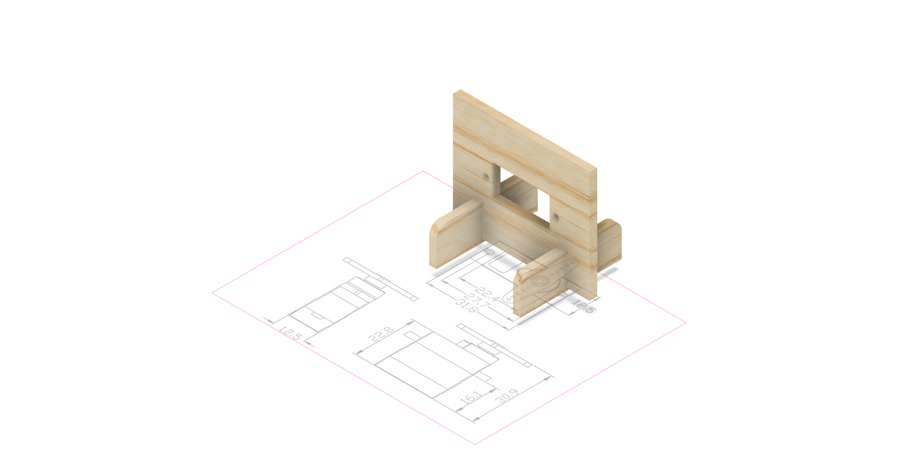
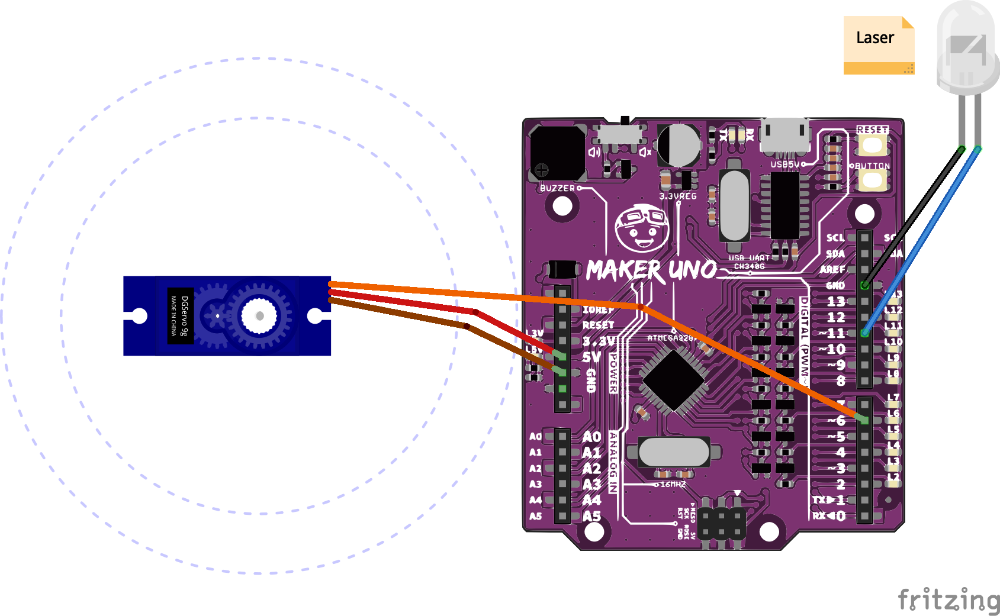

# Sezon 07 :: Rysunki laserowe na suficie
## Etap 01 tworzenia robota rysującego

## Poruszone zagadnienia

### Tworzenie uchwytu do serwa w Fusion 360
- Powtórzenie zasad robienia szkicu z wymiarowaniem
- Przydatna technika z wkładaniem na Canvas rysunku wymiarowanego przedmiotu

### [Dioda laserowa](https://github.com/CreativeCodingPL/PhysicalComputing/tree/2019/s01_pierwsza_dioda_i_prezenty#dioda-laserowa-czerwona) 
- Można zrobić zabawkę dla kota, albo rysować wzory na suficie. Długości światła 650 nm, czyli czerwona. Moc 5mW - to sporo! uwaga na oczy!

### [Serwo](https://github.com/CreativeCodingPL/PhysicalComputing/tree/2019/s01_pierwsza_dioda_i_prezenty#serwo) - albo inaczej serwo mechanizm, albo serwo motor
- Poruszanie diodą za pomocą serwa. Serwomechanizm ustawia się pod zadanym w kodzie kontem. Potrzebuje niewiele czasu by przesunąć orczyk do zadanego konta. Ten model pokonuje 60 stopni w około 0,12 czyli około 120 ms. W praktyce dużo wolniej, przy eksperymentach z laserem ustaliśmy, że punkt nie rozmasuje się (nie jest linią) jak poczekamy na ruch o 5 stopni około 70 ms - mechanika :)

## Materiały pomocnicze 
- [Laser Diode ignites a match](https://www.youtube.com/watch?v=DSwHNE-rjv4)

## Schematy

### neopixel_irSensor

