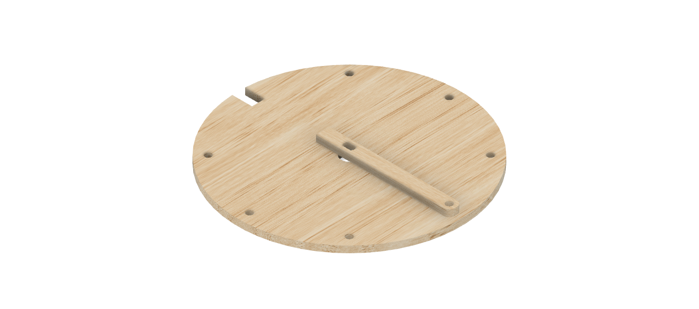

# Sezon 08 :: Stepper motor i czujnik krańcowy
## Etap 02 tworzenia robota rysującego

## Poruszone zagadnienia

### Poruszanie silnikiem 
Silnik ustawia się pod zadanym w kodzie kątem. Dokładność jest zależna od trybu: **AccelStepper::FULL4WIRE** - *szybciej, ale mniej dokładnie* lub **AccelStepper::HALF4WIRE** - *wolniej, ale dokładniej*. Ten model silnika (24BYJ48-N08W) pokonuje 360 stopni (jeden obrót) w 32 krokach. Przekładnia 64:1 . Do kontroli silnika krokowego używamy biblioteki [AccelStepper](http://www.airspayce.com/mikem/arduino/AccelStepper/classAccelStepper.html).

### Czujnik szczelinowy
Czujnik szczelinowy, u nas zastosowany jako czujnik krańcowy, pozwalający znaleźć początkową pozycje, punk odniesienia dla dalszego ruchu. 
Jak działa czujnik szczelinowy: Poprzez emisję wiązki światła podczerwonego wykrywa, kiedy obiekt przechodzi przez szczelinę między słupkami. Czujnik posiada wyjście cyfrowe i analogowe. Po podłączeniu zasilania, na wyjściach pojawią się stany logiczne 0 lub 1 (wyjście cyfrowe), lub zakres 0-1023 (wyjście analogowe).

## Przydatne linki
- [Jak działa silnik krokowy na przykładzie 28BYJ-48](https://youtu.be/B86nqDRskVU)
- [AccelStepper Class Reference](http://www.airspayce.com/mikem/arduino/AccelStepper/classAccelStepper.html)

## Konstrukcja w Fusion 360
Tarcza i wskazówka oraz wycięcie na sinik i czujnik.
- [Plik do edycji w Fusion 360](https://a360.co/2NCbt8u) 
- [DXF gotowy do cięcia na laserze](tarczaR14.dxf)

## Schematy

### Jak podłączyć arduino i sterownik silnika krokowego
